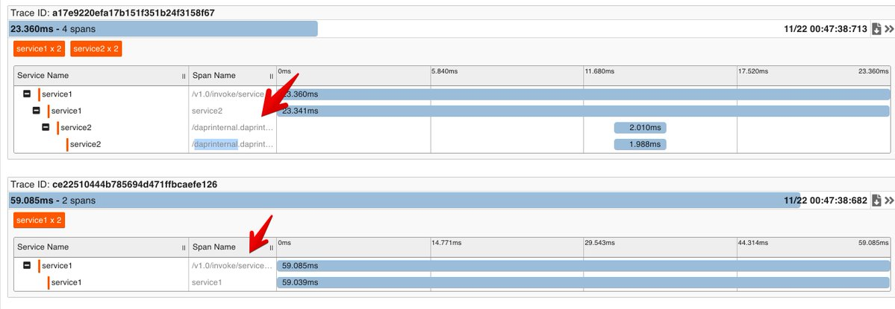
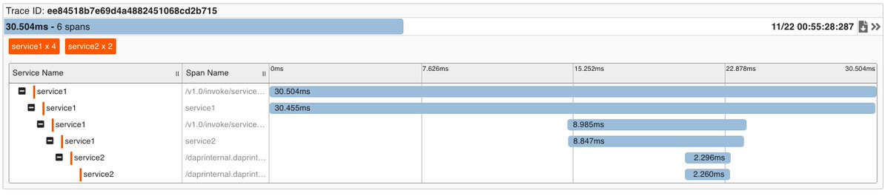

test dapr's distributed tracing between two services.
----------------------------------

## pre-requirments

+ install dapr (see https://github.com/dapr/samples/tree/master/1.hello-world)
+ node
    + `npm install` in service1, sercice2 directory.

## run 

### run zipkin

`docker run -d -p 9411:9411 openzipkin/zipkin`

run service1, service2

in service1

```
dapr run --app-id service1 --app-port 3000 --port 3500 --config ./components/tracing.yaml  node app.js
```

in service2

```
dapr run --app-id service2 --app-port 3001 --port 3501 --config ./components/tracing.yaml  node app.js
```

## test application

call service2 (other terminal)

```
POST http://localhost:3501/v1.0/invoke/service2/method/apply
{"name":"test"}
```

call service1 (service2 call via serivice1)

```
GET http://localhost:3500/v1.0/invoke/service1/method/hello
```

### x-correlation-id propagation

if you need to continue tracing span following service,
include `x-correlation-id` header in request.

sample is bellow.

```
    fetch(service2URL, {
        method: "POST",
        body: JSON.stringify({name:"service1"}),
        headers: {
            "content-type":"application/json"
            , "x-correlation-id" : req.headers["x-correlation-id"]
            }
```

if x-correlation-id does not include, new trace start in service2.

result is this.




if x-correlation-id include in request, trace is single.



this is same limitaion in envoy (https://www.envoyproxy.io/docs/envoy/latest/intro/arch_overview/observability/tracing#trace-context-propagation)
but, dapr is simple because only propate `x-correlation-id` header only.
